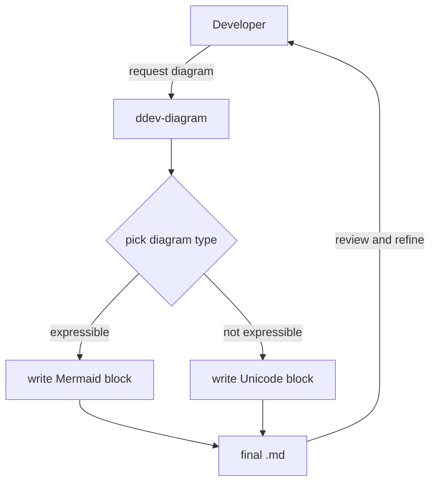

# 图形方法示例

说明：展示 ddev-diagram 的工作流程，默认输出 Mermaid，Mermaid 表达不了时才退回 Unicode 框图。

```mermaid
flowchart TD
  Dev["Developer"] -->|request diagram| DD["ddev-diagram"]
  DD --> Pick{"pick diagram type"}
  Pick -->|expressible| MM["write Mermaid block"]
  Pick -->|not expressible| UU["write Unicode block"]
  MM --> MD["final .md"]
  UU --> MD
  MD -->|review and refine| Dev
```

> `ddev-diagram` 先按图型选 Mermaid 语法；只有字节/位布局、目录树这类 Mermaid 保不住格式的场景才退回 Unicode 制表符框图。图写入 `.md` 后交给用户确认，不满意直接重画整张。
