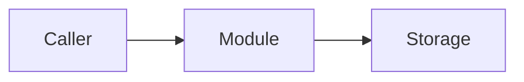
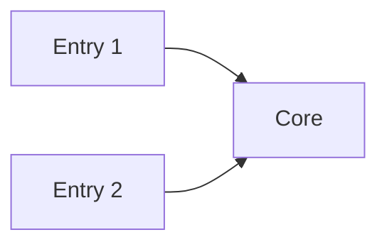
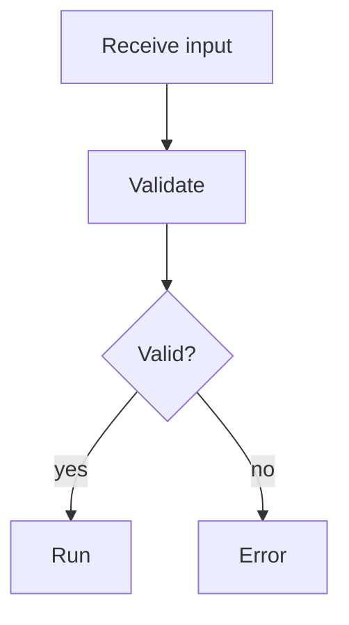
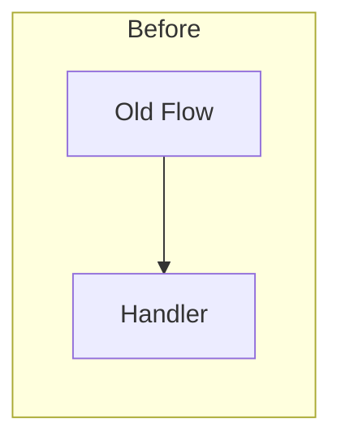
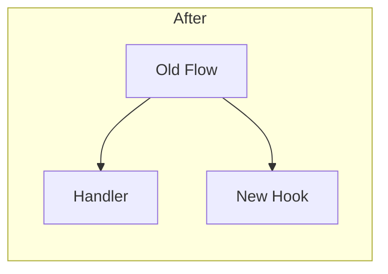
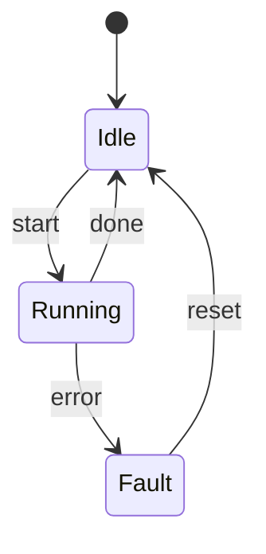
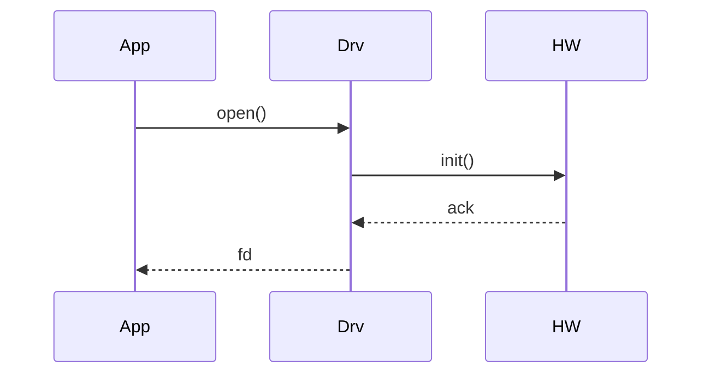

# 图形模板

## 架构图模板



## 接入点图模板



## 流程图模板



## 前后对照图模板

同一套节点名，两张图并排放在同一小节：





## 状态图模板



## 时序图模板



## Unicode 框图模板（退回路径）

只在字节/位布局、目录树、或 Mermaid 表达失真时使用。框内标签用英文。

```text
┌──────────┬──────────┐
│  Byte 0  │  Byte 1  │
├──────────┼──────────┤
│   type   │  length  │
└──────────┴──────────┘
```

```text
detail/
├── overview.md
└── structures/
    └── job-context.md
```
