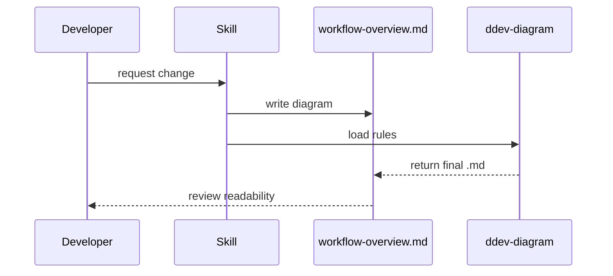

# 架构图工作流示例

说明：架构图默认以 Mermaid 写入 `.md`，遵循 [ddev-diagram](../../ddev-diagram/SKILL.md) 规范。

```mermaid
sequenceDiagram
  participant Dev as Developer
  participant Skill
  participant MD as workflow-overview.md
  participant DD as ddev-diagram
  Dev->>Skill: request change
  Skill->>MD: write diagram
  Skill->>DD: load rules
  DD-->>MD: return final .md
  MD-->>Dev: review readability
```

> 图写入 `.md` 后由用户复核可读性；看不懂时优先重画整张，而不是补长文说明。
