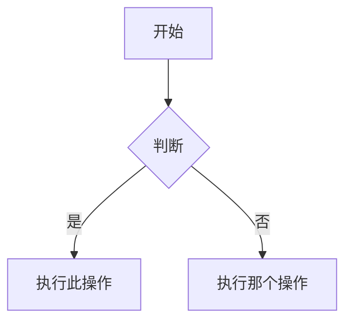

# Obsidian Flavored Markdown 技能

创建和编辑合法的 Obsidian Flavored Markdown。Obsidian 在 CommonMark 和 GFM 基础上扩展了 wikilinks、embeds、callouts、properties、comments 等语法。本技能仅涵盖 Obsidian 特有扩展——标准 Markdown（标题、加粗、斜体、列表、引用、代码块、表格）视为已知知识。

## 工作流：创建 Obsidian 笔记

1. **添加 frontmatter**，在文件顶部包含属性（title、tags、aliases）。所有属性类型见 [PROPERTIES.md](references/PROPERTIES.md)。
2. **撰写内容**，使用标准 Markdown 组织结构，辅以下方的 Obsidian 特有语法。
3. **关联相关笔记**，使用 wikilinks（`[[笔记名]]`）建立 vault 内部连接；外部 URL 使用标准 Markdown 链接。
4. **嵌入内容**，使用 `![[embed]]` 语法从其他笔记、图片或 PDF 嵌入内容。所有嵌入类型见 [EMBEDS.md](references/EMBEDS.md)。
5. **添加 callouts**，使用 `> [!type]` 语法高亮展示信息。所有 callout 类型见 [CALLOUTS.md](references/CALLOUTS.md)。
6. **验证**笔记在 Obsidian 阅读视图下正确渲染。

> 在 wikilinks 和 Markdown 链接之间选择时：vault 内部笔记使用 `[[wikilinks]]`（Obsidian 自动追踪重命名），仅对外部 URL 使用 `[text](url)`。

## 内部链接（Wikilinks）

```markdown
[[笔记名]]                          链接到笔记
[[笔记名|显示文本]]                   自定义显示文本
[[笔记名#标题]]                      链接到标题
[[笔记名#^block-id]]                 链接到块
[[#同笔记内的标题]]                   同笔记内标题链接
```

在任意段落后追加 `^block-id` 来定义块 ID：

```markdown
这段话可以被链接。^my-block-id
```

对于列表和引用，将块 ID 放在块之后的单独一行：

```markdown
> 一段引用

^quote-id
```

## 嵌入（Embeds）

在任何 wikilink 前加 `!` 即可将其内容内联嵌入：

```markdown
![[笔记名]]                          嵌入完整笔记
![[笔记名#标题]]                      嵌入章节
![[image.png]]                       嵌入图片
![[image.png|300]]                   嵌入图片并指定宽度
![[document.pdf#page=3]]             嵌入 PDF 指定页
```

音频、视频、搜索嵌入和外部图片见 [EMBEDS.md](references/EMBEDS.md)。

## Callouts

```markdown
> [!note]
> 基本 callout。

> [!warning] 自定义标题
> 带自定义标题的 callout。

> [!faq]- 默认折叠
> 可折叠 callout（- 折叠，+ 展开）。
```

常用类型：`note`、`tip`、`warning`、`info`、`example`、`quote`、`bug`、`danger`、`success`、`failure`、`question`、`abstract`、`todo`。

完整类型列表（含别名、嵌套和自定义 CSS callouts）见 [CALLOUTS.md](references/CALLOUTS.md)。

## 属性（Frontmatter）

```yaml
---
title: 我的笔记
date: 2024-01-15
tags:
  - project
  - active
aliases:
  - 别名
cssclasses:
  - custom-class
---
```

默认属性：`tags`（可搜索标签）、`aliases`（笔记的替代名称，用于链接建议）、`cssclasses`（应用于笔记的 CSS 类）。

所有属性类型、标签语法规则和高级用法见 [PROPERTIES.md](references/PROPERTIES.md)。

## 标签（Tags）

```markdown
#tag                    内联标签
#nested/tag             带层级的嵌套标签
```

标签可包含字母、数字（不能作为首字符）、下划线、连字符和正斜杠。标签也可以在 frontmatter 的 `tags` 属性中定义。

## 注释（Comments）

```markdown
这是可见文字 %%但这是隐藏的%% 更多可见文字。

%%
这个整块在阅读视图中隐藏。
%%
```

## Obsidian 特有格式

```markdown
==高亮文本==                   高亮语法
```

## 数学公式（LaTeX）

```markdown
行内：$e^{i\pi} + 1 = 0$

块级：
$$
\frac{a}{b} = c
$$
```

## 图表（Mermaid）

````markdown

````

要将 Mermaid 节点链接到 Obsidian 笔记，添加 `class NodeName internal-link;`。

## 脚注（Footnotes）

```markdown
带脚注的文本[^1]。

[^1]: 脚注内容。

行内脚注。^[这是行内脚注。]
```

## 完整示例

````markdown
---
title: 项目 Alpha
date: 2024-01-15
tags:
  - project
  - active
status: in-progress
---

# 项目 Alpha

本项目旨在用现代技术[[改进工作流]]。

> [!important] 关键截止日期
> 首个里程碑截止于 ==1月30日==。

## 任务

- [x] 初始规划
- [ ] 开发阶段
  - [ ] 后端实现
  - [ ] 前端设计

## 笔记

算法使用 $O(n \log n)$ 排序。详见 [[算法笔记#排序]]。

![[架构图.png|600]]

已在 [[会议纪要 2024-01-10#决策]] 中评审。
````

## 参考

- [Obsidian Flavored Markdown](https://help.obsidian.md/obsidian-flavored-markdown)
- [内部链接](https://help.obsidian.md/links)
- [嵌入文件](https://help.obsidian.md/embeds)
- [Callouts](https://help.obsidian.md/callouts)
- [属性](https://help.obsidian.md/properties)
